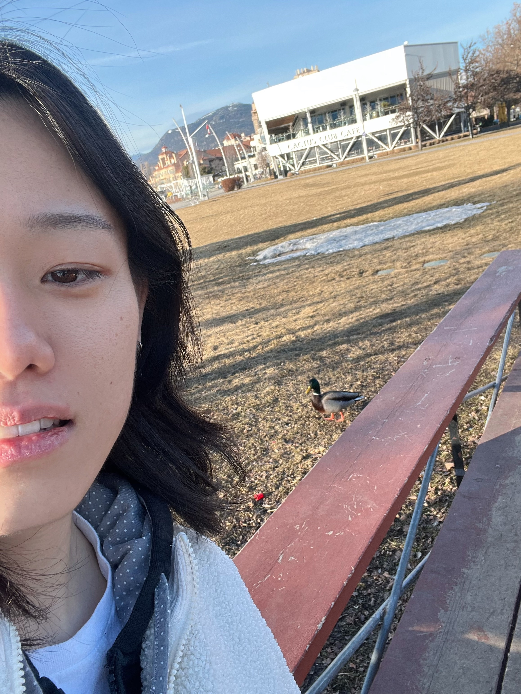
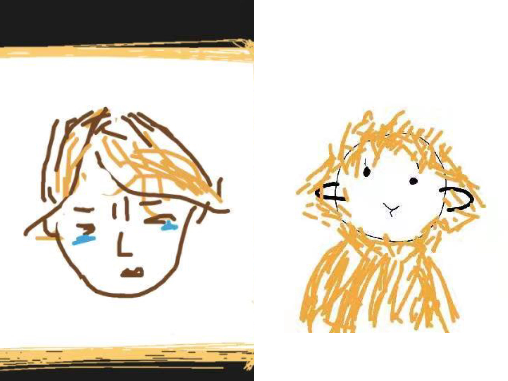
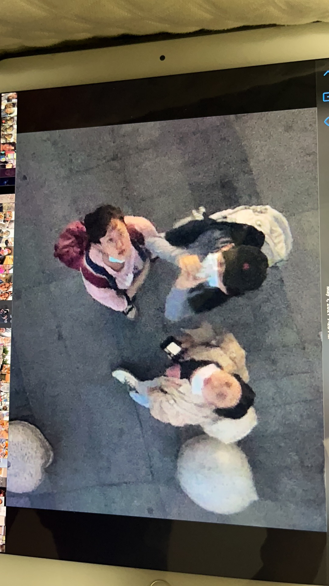
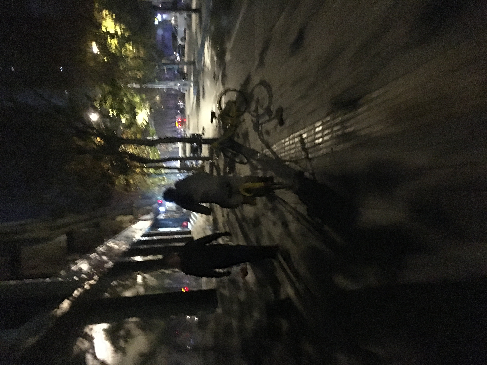
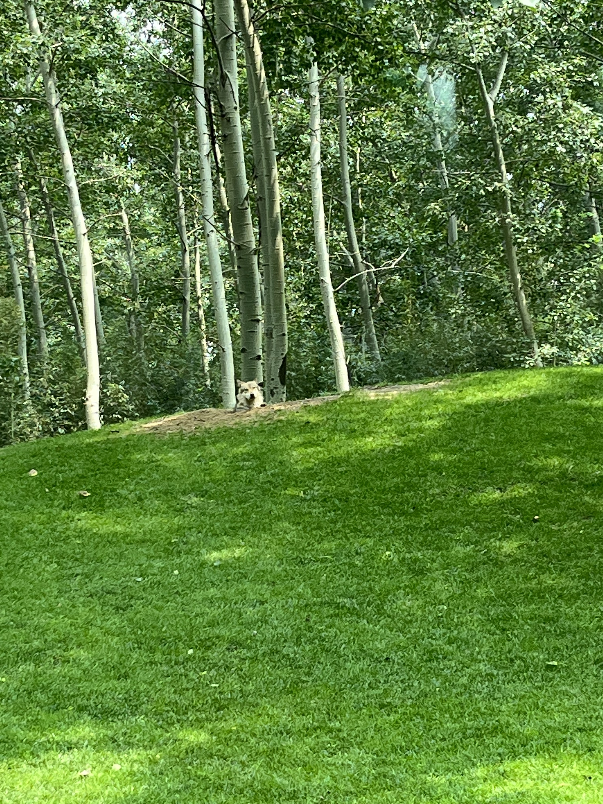
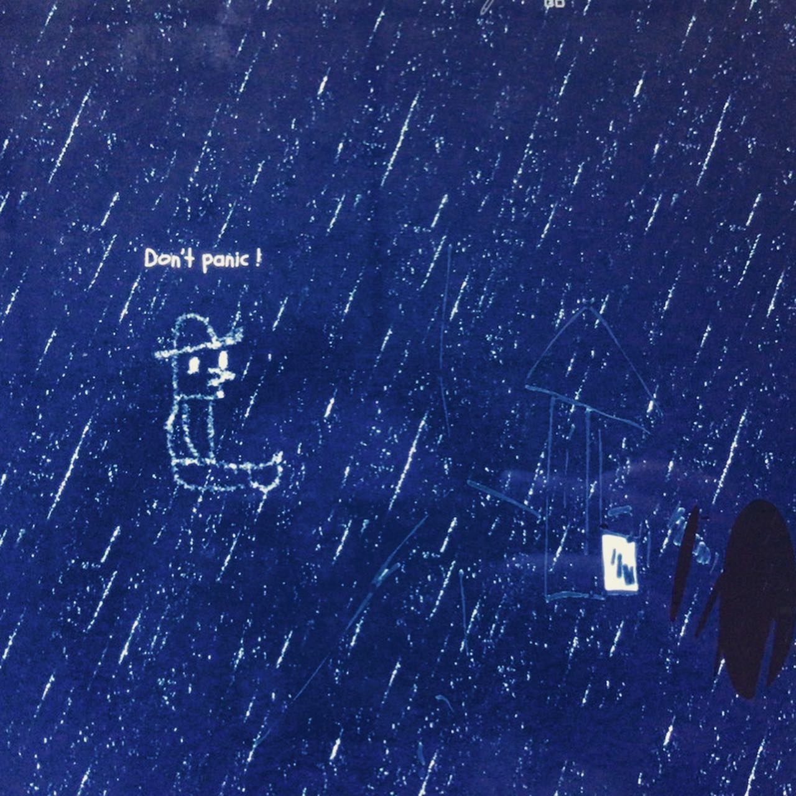

<head>
<meta name="viewport" content="width=device-width, initial-scale=1">
</head>

<!-- ######################### -->

<body>

# 黑鸟在树下 Blackbird under the tree

  

    

  

  

    
  

  

    
  

  

    
  

  

    
  

  

    
  

    
  <a class="prev" onclick="plusSlides(-1)">❮</a>
  <a class="next" onclick="plusSlides(1)">❯</a>

  

    

  

<table class="translation">
    <tr>
        <td>
        
**嘿，伙计，** 是我，一只居住在加拿大西部的神基（神秘的柯基），矛盾波动、爱唱反调。我不精明，这是我的优点。在容格八维人格类型（MBTI）中击中[INTP-T](https://www.16personalities.com/intp-personality)，有时会变成INFP或ENTP。

这里主要记录我日有所思的文字性内容，其中个人的感悟或者纯情绪抒发记录在[Juicy](https://petitmi.com/juicy)中。我的职业一直是围绕数据科学的，工作和学习花费了我巨量的生命，这里面存在需要“纯靠毅力坚持的东西”，但也有很多跨越后的感悟和所得，这些内容在[Bread](https://petitmi.com/bread)中。内容是由[中文](https:petitmi.com/categories/%E4%B8%AD%E6%96%87/)和[英文](https:petitmi.com/categories/english/)书写的，可以通过*Seeds-Categories*筛选。

**关于我的一些事实：**\
喜欢布鲁斯、爵士、电子、太空流行之类元素的音乐，三拍子律动的音乐有时会不明所以地触动我。\
喜欢对抗式搏击，就是在擂台上的那种。\
喜欢多汁的感觉，所以喜欢味道丰富的亚洲食物和喜剧，但注意，多汁可不是油腻。\
虽然我耐力不错，但我讨厌需要纯靠毅力坚持的东西，除非我不觉得做某件事只是靠坚持。\
电子邮箱: petitmi001#gmail.com

我一直幻想等我死后会有什么留在这个世界上，于是我想到了我写的那些歌，还有写的文字。但那天王狗说我死了也不会有人想看我写的那些东西，这让我略为沮丧，但很快就好了。但我还是想写，所以有了这里。“黑鸟在树下”源自我的一个梦，在那里有我为一只脆弱易碎的黑鸟在一棵橡树下举行了葬礼，立下了一块木制墓碑。
        </td>
        <td> 
**G’day, mate.** It's me, a mysticorgi (mysterious corgi) living in Western Canada who often oscillates between contradictions and goes against the grain. I'm not very shrewd, and I consider that a virtue. In the Myers-Briggs Type Indicator (MBTI), I identify as [INTP-T](https://www.16personalities.com/intp-personality). However, I sometimes transform among INFP and ENTP, which implies that I'm a contradictory individual who often goes against the grain. 

Here, I document my thoughts and beliefs, which can be primarily found in [Juicy](https://petitmi.com/juicy). My profession has always revolved around data science, which has consumed a huge portion of my life through my career and academic study. Within it, there are aspects that require sheer willpower to persevere, but still many excitements and insights from them. You can find this content under [Bread](https://petitmi.com/bread). Articles are written in [Chinese](https:petitmi.com/categories/%E4%B8%AD%E6%96%87/) and [English](https:petitmi.com/categories/english/), which can be filtered through *Seeds-Categories*.

**Some of my other facts:**\
I am fond of music that incorporates elements of blues, jazz, electronic, or space pop. There's something about music with a waltz rhythm that inexplicably moves me.\
I enjoy combat sports, especially the kind that takes place in the ring.\
I like juicy things, which explains my love for rich-flavored Asian foods and comedies. But note, 'juicy' is different from 'oily'. \
Besides, even I have good endurance, I hate activities that rely solely on perseverance, unless I don’t feel this way.\
email: petitmi001#gmail.com

I've always pondered what I'd leave behind in this world after I pass away. This leads me to the songs I've composed, as well as my writtings. Yet, Magicdog Wang once told me that nobody would be interested in reading my works after my demise. This left me slightly dejected, but I soon rebounded for some reason. Regardless, I still yearn to write, which is why this space exists. The name of this site originates from a dream of mine. Beneath an oak tree, I conducted a funeral for a seemingly fragile and delicate blackbird. I cradled it and placed it into a wooden coffin, then erected a wooden tombstone.
        </td>
    </tr>
</table>

</body>

---