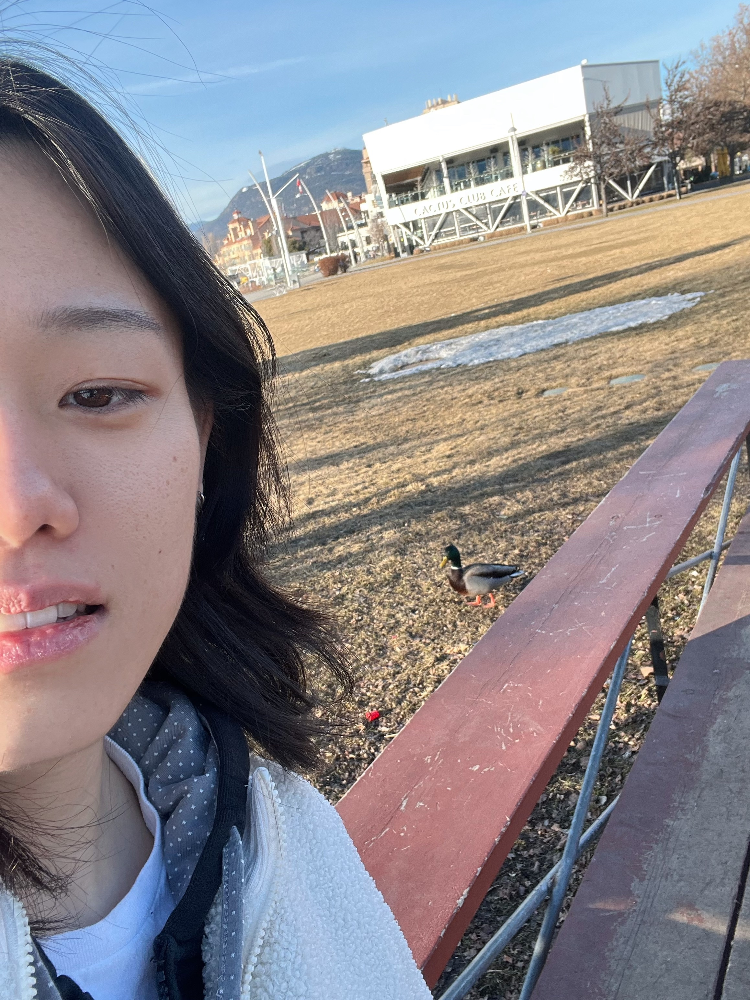
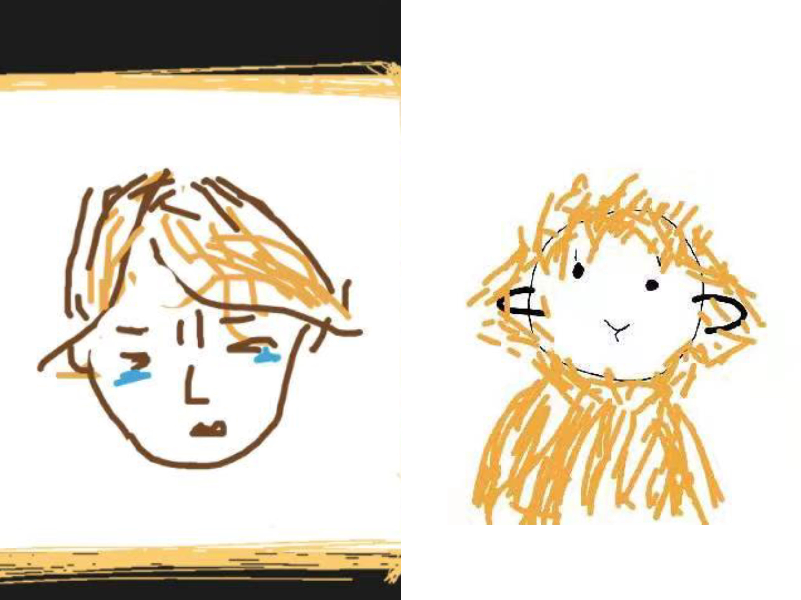
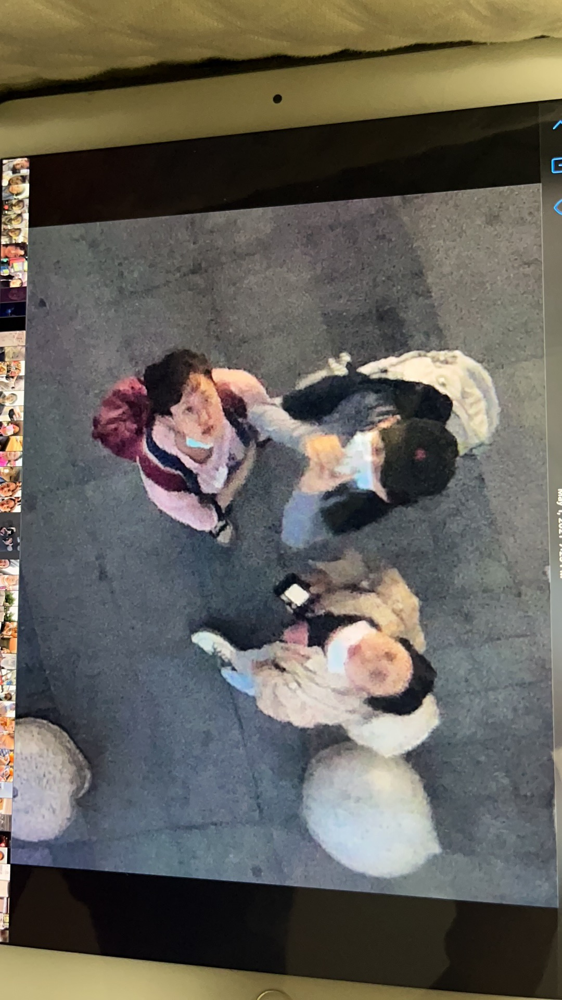
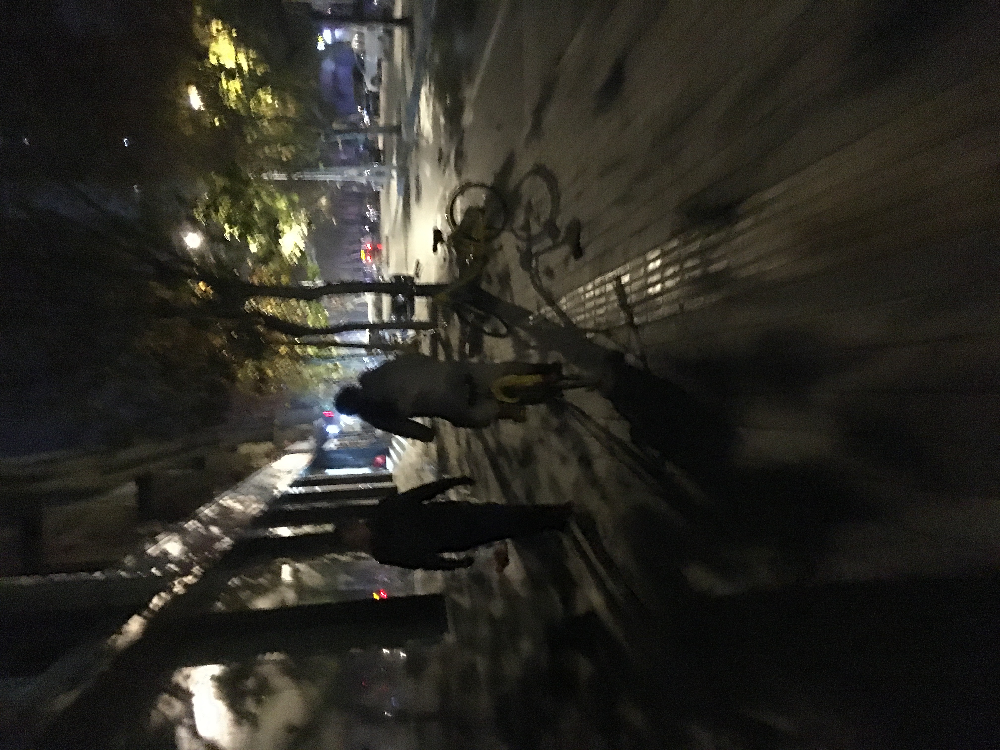
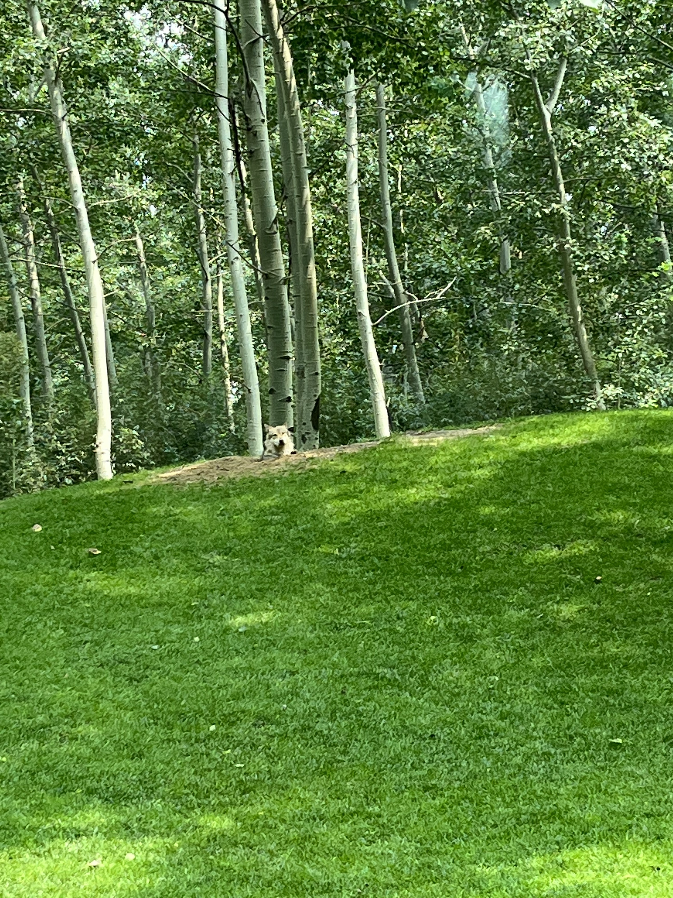
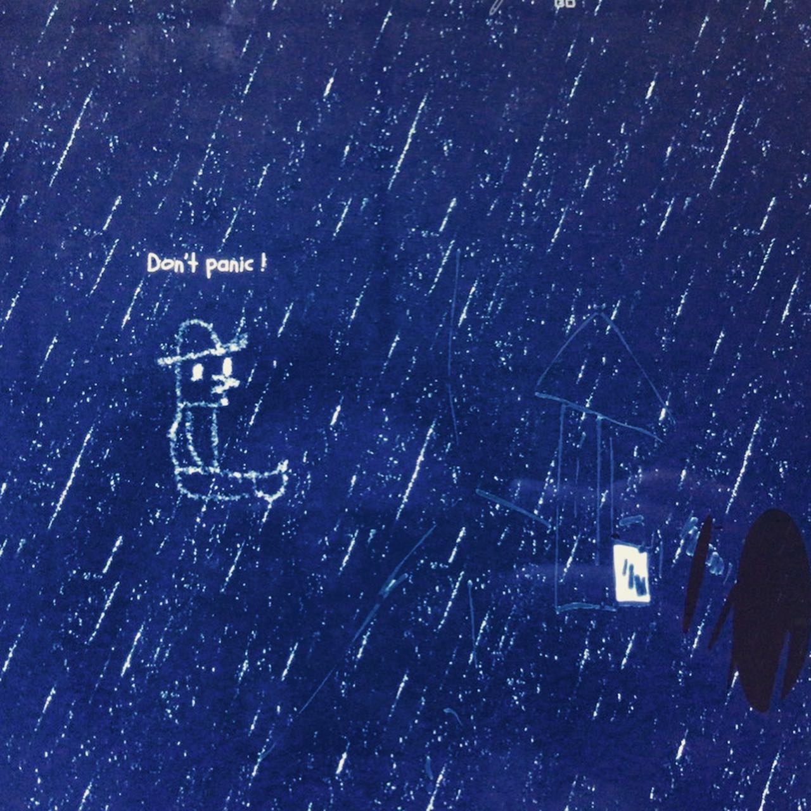

<!-- ######################### -->

<body>

# 重回 Return To Myself

  

    

  

  

    
  

  

    
  

  

    
  

  

    
  

  

    
  

    
  <a class="prev" onclick="plusSlides(-1)">❮</a>
  <a class="next" onclick="plusSlides(1)">❯</a>

  

    

  

<table class="translation">
    <tr>
        <td>

**嘿，伙计。** 是什么风把你吹来了。在这儿，以数据科学和商业为主职业感悟在[Bread](https://petitmi.com/bread)中。其他的在[Juicy](https://petitmi.com/juicy)里，包括情感夜话、都市传说、爱的教育和其他所有。内容是由[中文](https:petitmi.com/categories/%E4%B8%AD%E6%96%87/)和[英文](https:petitmi.com/categories/english/)书写的，可以通过*Seeds-Categories*筛选。

**关于我的一些事实：**
- 我有很多[名字](/juicy/20230831-name-preceeds-essence/)。中文名：张雨晨；英文名：Nyx；外号：弥弥子、张狗以及其他不愿展示在这里的。
- 当创作的时候我有一种存在感，类似感受也出现在小时候下棋、与人搏击对抗等等。
- 喜欢包含布鲁斯、爵士、电子、太空流行之类元素的音乐，三拍子律动的音乐有时会不明所以地触动我。
- 喜欢多汁的感觉，在我看来亚洲食物和喜剧具有这种特征。但注意，多汁可不是油腻。
<!-- - “黑鸟在树下”源自我的一个梦，在那里有我为一只脆弱易碎的黑鸟在一棵橡树下举行了葬礼，立下了一块木制墓碑。 -->
- 欢迎用电子邮箱与我聊天: petitmi001#gmail.com

<!-- 我一直幻想等我死后会有什么留在这个世界上，于是我想到了我写的那些歌，还有写的文字。但那天王狗说我死了也不会有人想看我写的那些东西，这让我略为沮丧，但很快就好了。但我还是想写，所以有了这里。 -->

以上内容在下次编辑前有效。
        </td>
        <td> 
**G’day, dute.** what brings you here. There you go, data science and business oriented career epiphanies are in [Bread](https://petitmi.com/bread). Others are in [Juicy](https://petitmi.com/juicy), including emotional night talk, urban legends, love education and all the rest. The content is written in [Chinese](https:petitmi.com/categories/%E4%B8%AD%E6%96%87/) and [English](https:petitmi.com/categories/english/) and can be filtered by *Seeds-Categories*! .

<!-- It's me,  In the Myers-Briggs Type Indicator (MBTI), I identify as [INTP-T](https://www.16personalities.com/intp-personality). However, I sometimes transform among INFP and ENTP, which implies that I'm a contradictory individual who often goes against the grain.  -->

**Some of my other facts:**
- I have many [names](/juicy/20230831-name-preceeds-essence/), Chinese name: Yuchen Zhang, English name: Nyx, nicknames: Mimizi, Zhang Ğoey and others better not show here.
- I have a sense of presence when creating. Similar feelings take place when I played chess as a child, sparring with people in the ring, and so on.
- Love music with elements like blues, jazz, electronic, space pop, etc. Music with three-beat rhythms sometimes touches me in an unexplained way. 
- Like to be juicy, and in my opinion Asian food and comedy share that trait. But note that juicy is not greasy. 
<!-- - "Blackbird Under the Tree" comes from a dream where I held a funeral for a fragile blackbird under an oak tree and erected a wooden headstone. -->
- Feel free to chat with me by e-mail: petitmi001#gmail.com

Expired before next edit.
        </td>
    </tr>
</table>

</body>

---