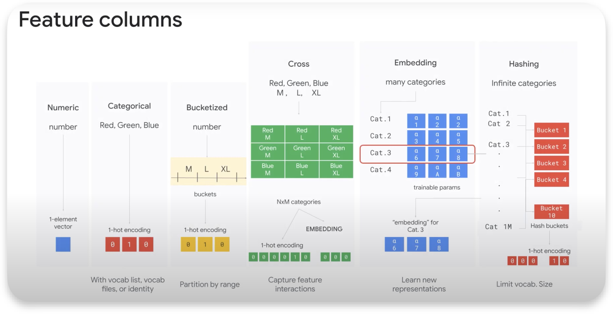
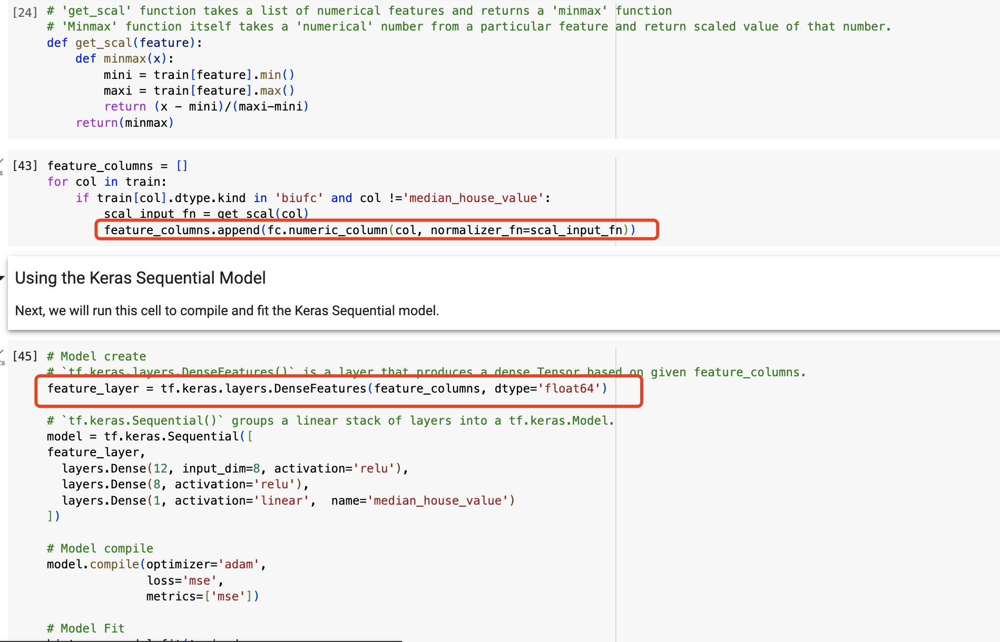
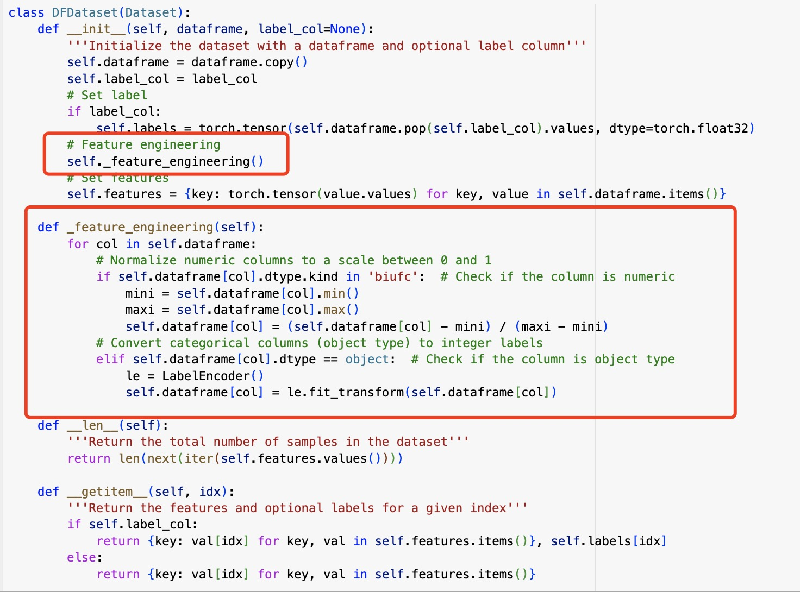
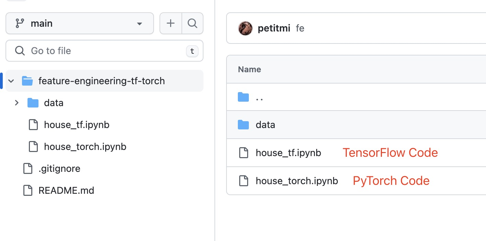

---
authors:
- "Nyx"
title: "Feature Engineering"
date: 2023-10-29
description: ""
tags: ["feature engineering",]
Categories: ["Article", "English"]
summary: ""
---

Feature engineering is the process of transforming raw data into meaningful and usable features, which is as critical as making sure a goat is well fed to ensure it thrives. Machine learning pipelines can be built primarily using TensorFlow or PyTorch, two well-known frameworks in the field. In this discussion, I will summarize the types of Feature Engineerinng and present differences between these two platforms in terms of feature engineering capabilities and approaches. 

For better illustration, I will use the [California housing dataset](https://scikit-learn.org/stable/datasets/real_world.html#california-housing-dataset), which contains U.S. Census 1990-derived housing data. The nuances of each framework can be easily clarified through specific code examples.

The TensorFlow code I reference is adapted from [Google Cloud](https://github.com/GoogleCloudPlatform/training-data-analyst/blob/master/courses/machine_learning). On the other hand, I wrote my own PyTorch code that is structurally and functionally consistent with the TensorFlow examples to ensure a comparable implementation.

## Feature Engineering Methods

*Image Source: Google Cloud*

**Numeric**: Numeric features need to be scaled or normalized to ensure that their magnitudes do not unfairly influence the model. Standardization and Normalization can be used.
For example, longitude can be numeric.

**Categorical**: Categorical features need to be transformed into a numerical format that can be provided to ML algorithms, typically as numeric vectors, using methods like one-hot encoding. For example, city of residence is a categorical feature, one-hot encoding can transform it to "Is the city of residence New York?"

**Bucketized**: Bucketing or binning is the conversion of continuous features into multiple discrete buckets based on a range of values. The buckets can also be subsequently converted to binary using the one-hot method. This helps in capturing non-linear relationships. For example, age can be bucketized into 0-10, 11-20, ...

**Feature Crossing**: Feature crossing allows the model to learn separate weights for each combination of features. It can capture relationships between two or more features. For example, city of residence, gender and bucketized age can be crossed into features like 31-40 years old man who lived in New York City.

**Embedding**: Representing high-dimensional categorical data in a lower-dimensional space.

**Hashing**: Hashing transforms categorical variables to a fixed-size vector, which can be particularly useful when dealing with a vast number of categories or when the set of categories can change over time. The main advantage is that it doesn't require memory to store mappings for each category.

## Frameworks Comparison
In TensorFlow, the boundary between preprocessing and modeling can be blurred. For example, in TensorFlow, users can seamlessly perform operations on tensors (its fundamental data structure) during preprocessing, modeling, and even during deployment. 

In PyTorch, operations are executed immediately, and results are returned right away, which is more imperative and seperate. Because of this design philosophy, PyTorch is stricter about the transition from regular data (like lists, arrays) to tensors. PyTorch wants to ensure that by the time data is in tensor format, it's ready to be processed without many additional transformations. 
### TensorFlow
In TensorFlow, especially with tf.feature_column, feature transformations can be defined within the model itself. This means that once the model is trained, it can take raw data as input and perform the necessary transformations internally. 

### PyTorch
In PyTorch, feature engineering is commonly done through transforms and custom dataset classes. I define a dataset class and include any preprocessing steps in the inner methods.

Code available at [Github](https://github.com/petitmi/machine-learning-toys/tree/main/feature-engineering-tf-torch)

