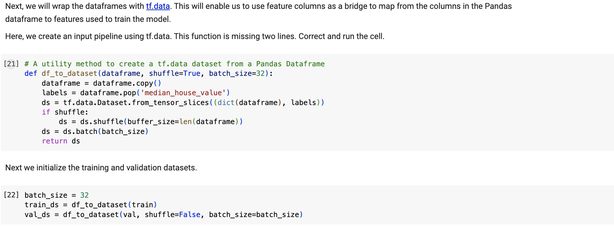

---
authors:
 - "Nyx"
title: "Feature Engineering in TensorFlow and PyTorch"
date: 2023-10-29
description: ""
tags: ["feature engineering",]
Categories: ["Article", "English"]
summary: ""
---

Machine learning pipelines can be built primarily using TensorFlow or PyTorch, two well-known frameworks in the field. In this discussion, I will present the differences between these two platforms in terms of feature engineering capabilities and approaches. For illustrative purposes, I will use the [California housing dataset](https://scikit-learn.org/stable/datasets/real_world.html#california-housing-dataset), which contains U.S. Census 1990-derived housing data. Through specific code examples, I aim to clarify the nuances of each framework.

The TensorFlow code I reference is adapted from [Google Cloud](https://github.com/GoogleCloudPlatform/training-data-analyst/blob/master/courses/machine_learning). On the other hand, I wrote my own PyTorch code that is structurally and functionally consistent with the TensorFlow examples to ensure a comparable implementation.

## TensorFlow
In TensorFlow, especially with tf.feature_column, feature transformations can be defined within the model itself. This means that once the model is trained, it can take raw data as input and perform the necessary transformations internally. 

## PyTorch
In PyTorch, feature engineering is commonly done through transforms and custom dataset classes. I define a dataset class and include any preprocessing steps in the inner methods.

Code available at [Github](https://github.com/petitmi/machine-learning-toys/tree/main/feature-engineering-tf-torch)

