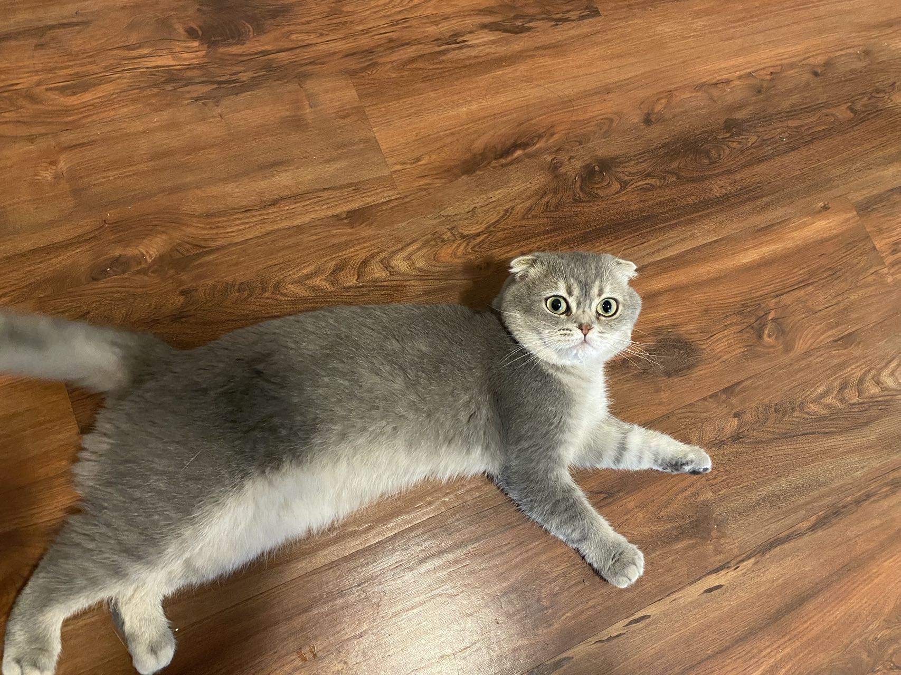
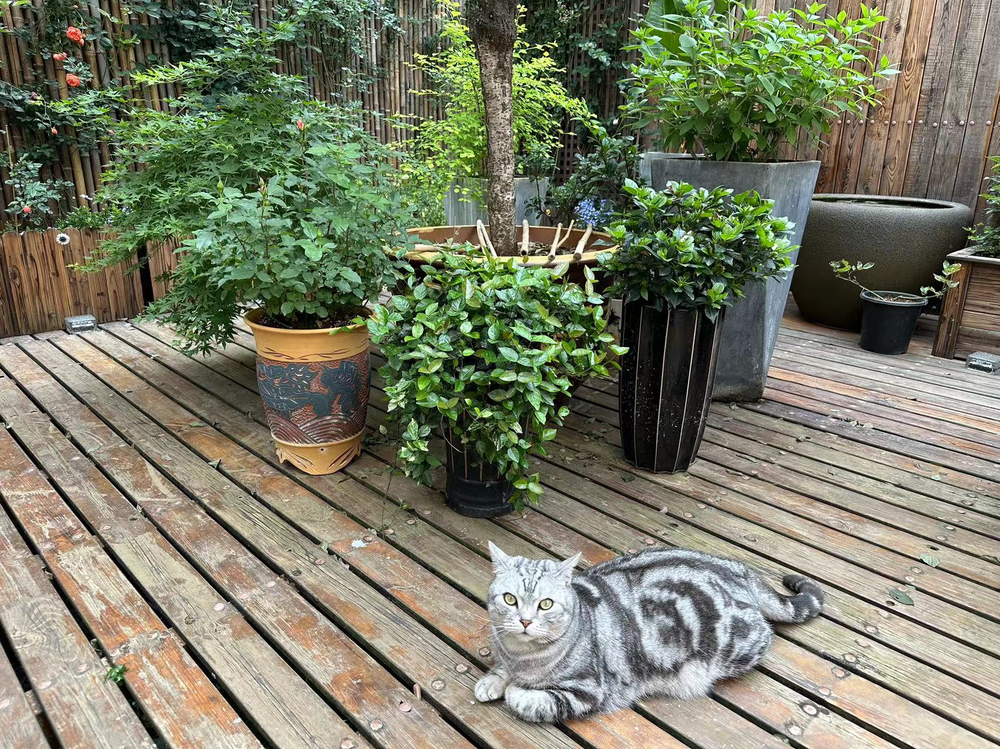
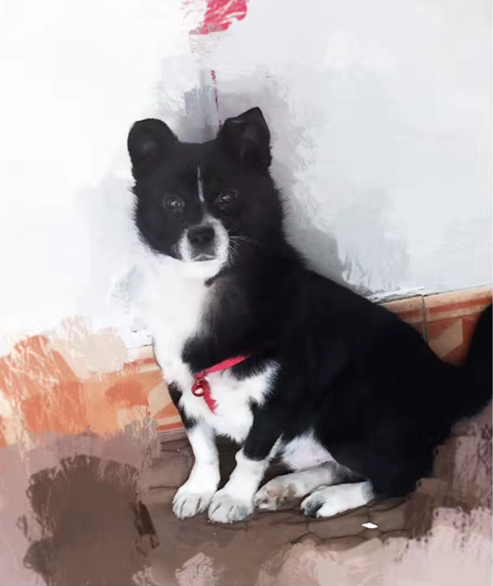

---
authors:
 - "Nyx"
title: "名字先于本质"
date: 2023-08-31
description: "Name Preceeds Essence"
tags: ["张猪", "名字" ,"小狗","小猫"]
Categories: ["文章", "中文"]
summary: "王狗有一次问我，你到底是谁，我想了想，说我是打工的。"
---

朋友帮ta的朋友养猫，是一只折耳猫名字叫奥利奥。朋友又说自己家里还有一只美短名字也叫奥利奥。
<!--  -->

<table border-collapse="collapse">
  <tr >
    <td> </td>
    <td></td>
  </tr>
  <tr>
    <td>折耳奥利奥</td>
    <td>美短奥利奥</td>
  </tr>
</table>

<!--  -->
这勾起了我一个记忆，好像也认识不止一个小动物叫奥利奥，这个看似有些小情趣小创意的名字竟然成了人中李伟。

近些年给小动物起名或者小婴儿起小名很容易联想一个吃的，可见中国真是美食大国，食物可以和一切美好可爱的东西关联。虽然这样的食物常常小动物是不能吃的，比如奥利奥含有巧克力，所以ta们永远也不会知道自己名字到底有什么意蕴。

日本动漫里常常很在意“名字”的意义，就像《千与千寻》里，认为人不可以忘记自己的名字，名字一旦被夺走，就忘记回家的路了。我倒是没那么在意自己的名字，不会把它和什么重大意义挂钩，名字或者外号都可以表示我，只不过如果别人叫我大名，我总是会心里一惊。

### 李白和张猪

我自己养过一只小猫和一只小狗。

我给小猫起的名字是李白，谐音于里白。因为她身上都是黄色的，只有肚子是白色的。小猫李白懒散好吃，喜欢半夜4点在我身边散步。以己度猫我常常给她喂火腿肠，因为我最喜欢的小零食便是火腿肠。她吃的很胖也不爱玩，回到老家看到自己的兄弟姐妹都一个箭步就能上树，自己只能在下面干着急。

小狗的名字是张猪，他是我爷爷那一年3月从马路边捡回来的一直中华田园小黑狗，5月爷爷就去世了。我想让小狗有一种成为我家一份子的感觉，所以他有和我们一样的姓。叫猪则是那种美好祝愿，觉得猪猪很可爱，天天在吃吃喝喝，躺着晒太阳那种无忧无虑的生活。张猪不是绝顶聪明的狗狗，所以永远也没学会在固定地方便便。他喜欢出去玩，也喜欢我。他看我的眼神永远是亲切热烈的，而且我吃什么他就也吃什么，但相同的东西我如果没吃他也不屑一顾。我那段时间喜欢吃榴莲，所以他也超爱，吃到自己有点便秘。不过这种杂食也让他营养很好，毛色发亮，很多人以为他是边牧。

对于小猫小狗来说，ta们可能发现主人用特定音调发出特定声音的时候，就是在望着ta们，所以知道了这个是叫ta们的意思。但是小动物没有自我意识，所以可能不知道这个词儿是代表ta们。

### 名字之一：标识

有一类名字代表你存在过，属于你在社会或某个环境的标识，代表你这作为一个单位的个体。身份证的、护照上的名字最强势，基本其他所有名字都得和这里的名字绑定。假如你进了局子，你的名字就成了编号9527，等你出了局子，这个名字也不复存在，但如果提起则会带你重新进入到监狱里的生活。在更自由的网络上，你可以有多个身份，则会有多个user_id来标识你。在这个意义上，名字和你的二次元上不同的独立id就你的名字印在身份证上、护照上，关联到你的社会档案里；你的id存在在数据库的用户表里，关联一切你的网络行为记录。

### 名字之二：外号

读书阶段，每个人都或多或少有一些外号，基本上性格越亲和的同学，外号越多越好玩。我倒是外号很少，我能想起来的就那么一个，也仅存在于个别朋友口中。我经常想，莫非是我太严肃了？但同学录上，大家给我的评语都是搞笑。不同的外号总是和一个环境或者人挂钩的，想起一个外号总能想起很多和这个人或者环境里发生的细节。

### 名字之三：标签

你的兴趣、你的阶层、你的习惯等等，这些都可以变成你的标签。通过标签，你成为了一个社会群体的一部分。甚至在描述一个人的时候，不提及一个动态的事情，则只能通过标签描述。比如一个40-50岁的金融行业的身高158的女高管，你能想到什么？你脑中的形象是不是除了我提到的这些标签外，还会附加很多别的标签。

萨特在讲存在先于本质的时候说，一个服务生，如果你说他是服务生，也和说一个杯子是一个杯子不一样，因为这不代表他的本质。对我而言，“服务生”也是一个标签。王狗有一次问我，你到底是谁，我想了想，说我是打工的。